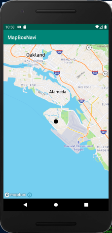
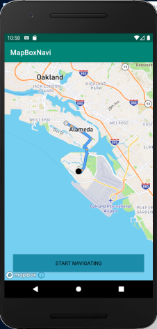
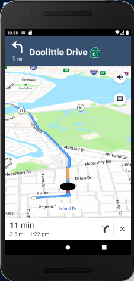

# MapBoxNavi
## Introduction
I tested MapBox Navigation on android.
This is navigation app based on MapBox SDK.
You can set destination, the app gives routing and turn-by-turn directions.
## Requirement
MapBox Navigation SDK Version (v0.41.0)
* com.mapbox.mapboxsdk:mapbox-android-navigation-ui:0.41.0
## Function
1. Show Map with current location  

2. Set destination and route  

3. Turn-By-Turn guide  

